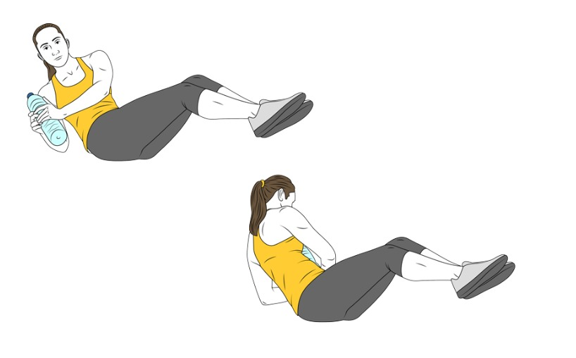
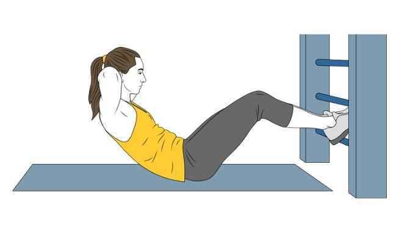
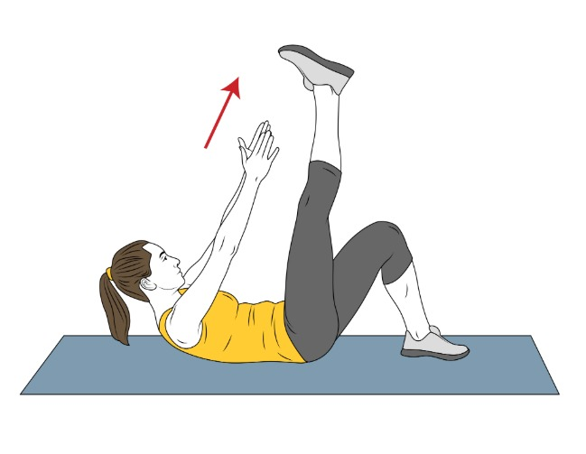

# 🏋️‍♂️ Rutina de Cardio + Core

## 🔥 1. Calentamiento / Cardio (30 minutos)

Realiza una de estas actividades durante 30 minutos para activar el cuerpo:

-   🚶 Andar rápido
-   🚴 Bicicleta
-   🏃 Correr

## 🚶‍♂️ Guía para andar (30 minutos)

| Tiempo    | Ritmo estimado  | Velocidad aprox. | Objetivo                                  |
| --------- | --------------- | ---------------- | ----------------------------------------- |
| 0–5 min   | Paso cómodo     | 4–5 km/h         | Calentamiento                             |
| 5–10 min  | Paso activo     | 5.5 km/h         | Empieza la activación cardiovascular      |
| 10–15 min | Paso rápido     | 6–6.5 km/h       | Ritmo ideal para quema de grasa           |
| 15–20 min | Paso muy rápido | 6.5–7 km/h       | Ritmo fuerte, sudor y respiración agitada |
| 20–25 min | Paso rápido     | 6–6.5 km/h       | Mantienes intensidad                      |
| 25–30 min | Paso relajado   | 4.5–5 km/h       | Enfriamiento                              |

### 🚴‍♂️ Guía para bicicleta estática (30 minutos)

| Tiempo    | Nivel de resistencia | Objetivo                                 |
| --------- | -------------------- | ---------------------------------------- |
| 0–5 min   | Nivel 2–3            | Calentamiento, ritmo suave               |
| 5–10 min  | Nivel 4–5            | Ritmo moderado, empiezas a sudar         |
| 10–15 min | Nivel 6–7            | Esfuerzo intenso pero estable            |
| 15–20 min | Nivel 4              | Bajamos un poco, ritmo moderado          |
| 20–25 min | Nivel 7–8            | Fase fuerte, como si subieras una cuesta |
| 25–30 min | Nivel 2–3            | Enfriamiento, ritmo suave                |

### 🧠 Recomendaciones

-   Si tu bici va del **1 al 20**, **multiplica x2** los niveles de la tabla.
-   Si no tiene números:
    -   **Resistencia baja** → pedaleo muy fácil
    -   **Resistencia media** → se nota el esfuerzo
    -   **Resistencia alta** → como subir una cuesta

### 🎯 Consejo de intensidad:

-   Debes poder hablar con frases cortas, pero no mantener una conversación larga.
-   Si vas muy cómodo: **sube un nivel**.
-   Si no puedes aguantar 5 minutos: **baja un nivel**.

## 💪 2. Ejercicios de Core (Abdominales)

Haz **3 rondas** de los siguientes ejercicios.  
En cada ronda haz **20 repeticiones por ejercicio**.

---

### 1. Abdominales clásicos

**Cómo se hace**:  
Túmbate boca arriba, rodillas flexionadas, pies apoyados. Manos detrás de la cabeza o cruzadas sobre el pecho. Eleva el torso sin tirar del cuello, y baja controlando.

**Repeticiones**: 3×20  
**Ilustración**:  

---

### 2. Abdominales oblicuos – lado derecho

**Cómo se hace**:  
Desde la posición inicial, sube el torso y gira hacia la derecha, intentando acercar el codo izquierdo a la rodilla derecha.

**Repeticiones**: 3×20  
**Ilustración**:  

---

### 3. Abdominales oblicuos – lado izquierdo

**Cómo se hace**:  
Mismo ejercicio, pero girando hacia la izquierda (codo derecho hacia rodilla izquierda).

**Repeticiones**: 3×20  
**Ilustración**:  

---

### 4. Abdominales con piernas en 90 °

**Cómo se hace**:  
Túmbate con las piernas elevadas en ángulo recto (90°). Realiza crunches normales manteniendo esa posición.

**Repeticiones**: 3×20  
**Ilustración**:  

---

### 5. Abdominales con piernas elevadas (piernas arriba y abajo)

**Cómo se hace**:  
Túmbate boca arriba. Sube y baja las piernas estiradas sin que toquen el suelo, controlando el movimiento con el abdomen. SE PUEDE HACER UNA PIERNA Y LUEGO LA OTRA.

**Repeticiones**: 3×20  
**Ilustración**:  

---

## Consejos útiles

-   Descansa **30–60 segundos entre ejercicios** y **1–2 minutos entre rondas**.
-   Mantén el abdomen **siempre contraído** durante los ejercicios.
-   Evita tirones; realiza los movimientos **de forma lenta y controlada**.
